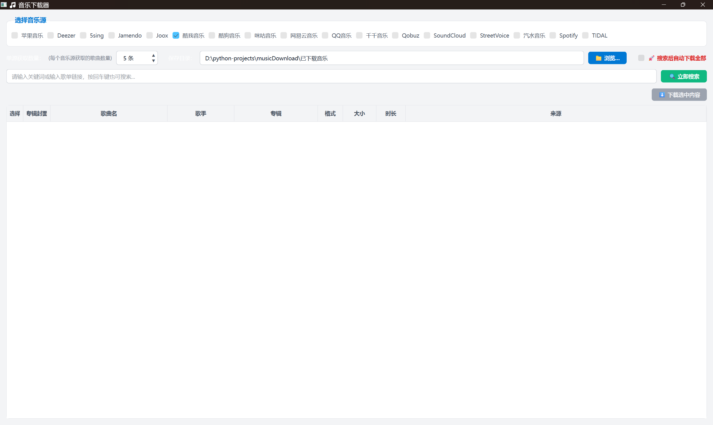

[原作者仓库](https://github.com/MrsEWE44/musicDownload)

一个基于 Python 和 Qt 的现代化音乐下载工具，支持多平台音乐搜索和下载功能。



## ✨ 主要特性

- 🎯 **多平台支持**：支持多个音乐平台的搜索和下载
- 🎨 **现代化界面**：采用 PySide6 构建的精美图形界面
- ⚡ **高效搜索**：搜索歌曲、专辑、歌手信息
- 📱 **详细信息展示**：显示歌曲封面、歌手、专辑等完整信息 *(新增)*
- 📋 **歌单排序**：支持搜索结果排序管理 *(新增)*
- 💾 **智能下载**：支持批量下载和自定义下载路径
- 🔧 **配置管理**：可保存搜索源偏好和下载设置 *(增强)*
- 📊 **进度追踪**：实时显示搜索进度 *(增强)*

## 🚀 快速开始

### 环境要求

- Python 3.8+
- Windows/macOS/Linux

### 安装步骤

1. **克隆项目**
```bash
git clone https://github.com/Skrepy/musicDownload.git
cd musicDownload
```

2. **创建虚拟环境**（推荐）
```bash
python -m venv venv
# Windows
venv\Scripts\activate
# macOS/Linux
source venv/bin/activate
```

3. **安装依赖**
```bash
pip install -r requirements.txt
```

4. **运行程序**
```bash
python main.py
```
或直接双击`main.pyw`文件

## 📁 项目结构

```
musicDownload/
├── main.py              # 程序入口
├── main.pyw             # 无控制台版本入口
├── requirements.txt     # 依赖包列表
├── data/               # 配置文件目录
│   └── config.json     # 用户配置文件
├── src/                # 源代码目录
│   ├── window.py       # 主窗口界面
│   ├── config.py       # 配置管理
│   ├── constants.py    # 常量定义
│   ├── widgets.py      # 自定义组件
│   ├── workers.py      # 后台任务
│   └── utils.py        # 工具函数
├── images/             # 界面截图
└── 已下载音乐/          # 默认下载目录
```

## 🎮 使用说明

1. **搜索音乐**：在搜索框输入歌曲名或歌手名，点击搜索按钮
2. **选择平台**：在左侧勾选要搜索的音乐平台
3. **下载音乐**：在搜索结果中右键选择要下载的歌曲
4. **管理设置**：通过菜单栏调整下载路径和其他偏好设置

## 🛠️ 开发说明

本项目基于原 [musicdl](https://github.com/CharlesPikachu/musicdl) 项目进行二次开发，优化了用户界面和交互体验，增加了更多实用功能。

### 改进

- 🎵 **歌曲详细信息展示** - 新增显示歌曲封面、歌手、专辑等完整信息
- 📋 **歌单排序功能** - 新增歌单排序功能，便于管理和查找音乐
- ⚙️ **设置持久化保存** - 新增配置文件保存功能，记住用户偏好设置
- 🔍 **单源获取优化** - 优化搜索源管理，支持自定义获取数量限制
- 🚀 **用户体验增强** - 改进整体交互体验和错误处理机制

---

*基于 [musicdl](https://github.com/CharlesPikachu/musicdl) 项目二次开发*
